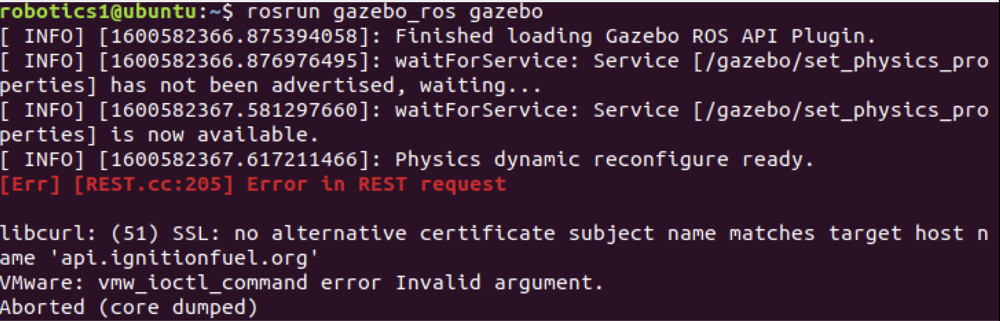

This page consists of common issues you might encounter throughout the lab.

## Issue 1:
    <p align="left">
    
    </p>  
### Solution:
  ```
  $ export SVGA_VGPU10=0
  ```  
  
## Issue 2:
    <p align="left">
    
    </p>
### Solution:
    ```
    $ sudo nano ~/.ignition/fuel/config.yaml
    ```    
- Replace `api.ignitionfuel.org` with `fuel.ignitionfuel.org`
- As shown below:
 <p align="left">
 
 </p>
- Then `hold Ctrl` + `o`
- Press `Enter` 
- Hold `Ctrl` + `x`

## Issue 3:
 <p align="left">
 
 </p>
### Solution:
- Update your system, then install the joint state publisher:
    ```
    $ sudo apt update
    $ sudo apt install ros-melodic-joint-state-publisher-gui
    ```
    
## Issue 4:
 <p align="left">
 
 </p>
 - Or an issue that displays something in the lines of:
  ```
  Or:
  Could not load controller 'MY_CONTROLLER_NAME' because controller type 'effort_controllers/JointPositionController' does   not exist.
  ```
### Solution:
 - Update your system, then install the effort controllers:
    ```
    $ sudo apt update
    $ sudo apt-get install ros-melodic-effort-controllers
    ```
    
## Issue 5:
If you encounter any issue where gazebo isn’t running properly, displays the previous world, displays a black screen, or just conveys any abnormalities. Also if you want to start from  a new world.
### Solution:

- First, run the following command:
  ```
  $ ps -x | grep gazebo
  ```
 <p align="left">
 
 </p>

- If it outputs something similar this, all you need to do is kill the current server, then next time you run gazebo it should run properly
  ```
  $ pkill gzserver
  ```
## Issue 6:
 <p align="left">
 
 </p>
 <p align="left">
 
 </p>
### Solution:
For this issue we must add a few lines of code to the launch file. The notion behind this solution is to group the nodes so that the information between them can flow properly. Inside your launch file, add the following line right under the `<launch>` :

  ```
  <group ns="/ram">
  ```
- Next add the following line right above the `</launch>` line:
  ```
  </group>
  ```
  
- As shown below:
 <p align="left">
 
 </p>
 
## Issue 7:
If you encounter any issue while trying to use catkin; 
  - catkin_make
  - catkin build
  
<p align="left">

</p>

### Solution:

- First, update your system:
   ```
   $ sudo apt update
   ```
   
- The following catkin commands are part of the catkin_tools package. Simply installing the package should fix the issue:
   ```
   $ sudo apt-get install python-catkin-tools
   ```
   
## Issue 8:
If you encounter any abnormalities with your robot model in RViz like the following:

  <p align="left">
  
  </p>
  
### Solution:

- Check if you have roscore running, if you do, shutdown roscore and it should fix the issue. 

## Issue 9:

  <p align="left">
  
  </p>
### Solution:

    ```
    $ sudo apt update 
    $ sudo apt-get install ros-melodic-ros-control ros-melodic-ros-controllers
    ```
 
