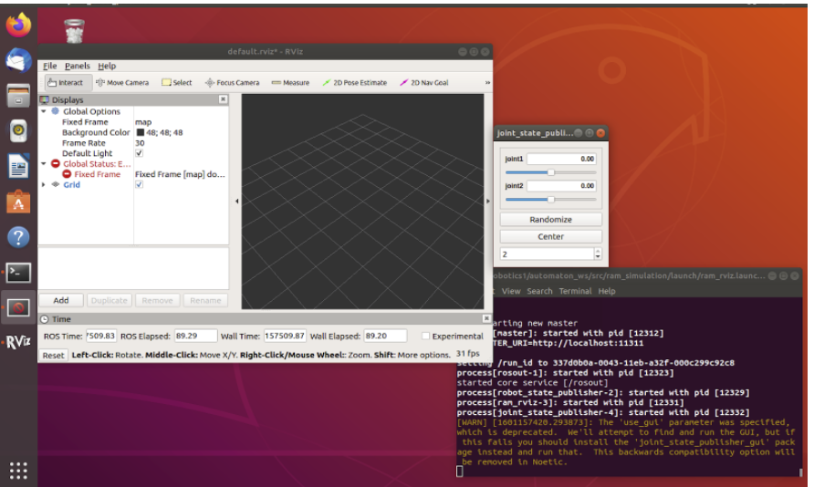
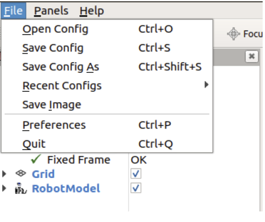
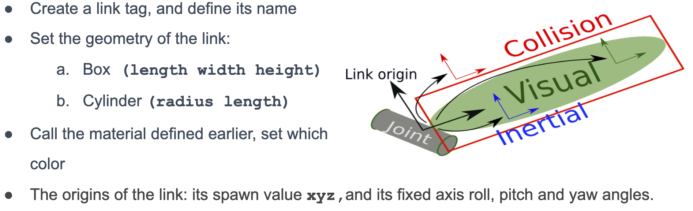
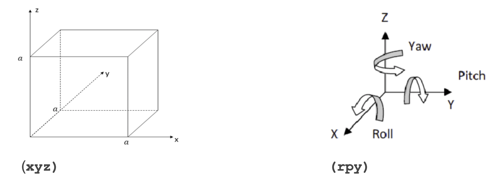
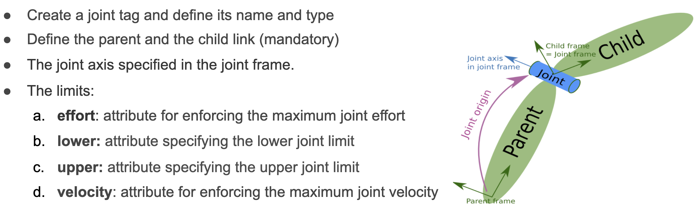
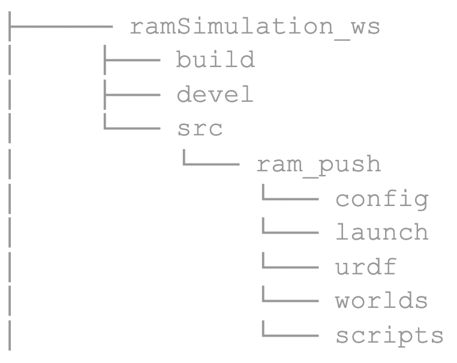
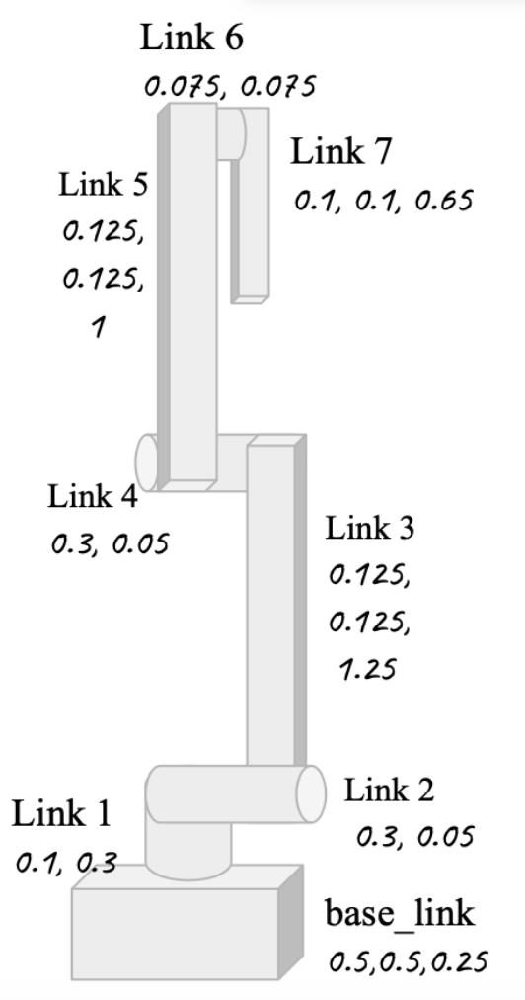
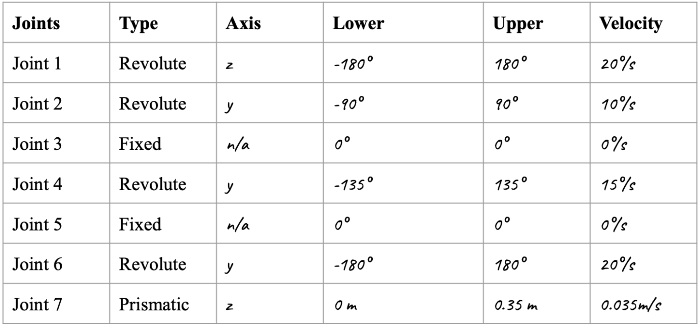

# Robotic Arm Push Lab 


## Description:
   Robot simulation software is making robotic automation safer, less risky, and much more obtainable. In this lab, you will be introduced to the basics of creating a robotic arm using ROS tools such as Rviz and Nodes, and Gazebo; a 3D dynamic simulator that can accurately and efficiently simulate populations of robots in complex indoor and outdoor environments. First, check you have the prerequisites in place, then you can direct to the introduction and get the lab started. 

## Prerequisites: 
* Ubuntu 18.04: https://releases.ubuntu.com/18.04/ (The Desktop Server is Recommended)
* python2 or python3
* Git (`sudo apt-get install git`)
* ROS Melodic: http://wiki.ros.org/melodic/Installation/Ubuntu (Follow the instructions to download)

## Introduction:
In this lab, you are going to design a Robotic Arm Manipulator from scratch, implementing the various elements and attributes to it, and move the robot using ROS topics and rqt. ROS stands for the Robot Operating System. It is an open source robotics middleware which consists of numerous software libraries and tools that will aid you in building robot applications. From drivers to state of the art algorithms and simulations, ROS encompasses all the needs to build a robotics project. It is highly recommended to install ROS and ubuntu through a virtual machine such as: VMware Fusion for MacOS (https://www.vmware.com/products/fusion/fusion-evaluation.html) or freeware VirtualBox available for both but with a bit lower quality (https://www.virtualbox.org/wiki/Downloads), install Ubuntu 18.04 Bionic full-desktop (Ubuntu 18.04.5 LTS (Bionic Beaver). Inside the linux distribution, install ROS melodic from the link provided. After having the prerequisites all set, follow the lab instructions sequentially. First, clone the github repository consisting of a simple RViz model, a gazebo world, launch files, and a simple script in both Python and C++ . If you encounter any issues throughout the trial, you can direct to the debugging issues file provided.

- Go ahead and clone the following github repository:
  ```
  cd ~
  git clone https://github.com/khouka/RoboticArmPush_Lab.git
  ```
- Note: Don’t forget to source your ROS system whenever opening a new shell
  ```
  $ source /opt/ros/melodic/setup.bash
  ```
- Before you run the example, first compile your code in your workspace and source the development folder of the workspace:
  ```
  $ cd  RoboticArmPush_Lab
  $ catkin_make 
  $ source /home/<account name>/RoboticArmPush_Lab/devel/setup.bash
  ```
- After you have successfully compiled the code without errors, it is time to run the launch file. Inside the workspace, run the following command:
  ```
  $ roslaunch minimal_demo coin_rviz.launch
  ```
- The format of launching a ROS launch file is the `roslaunch` command then the `<package name>`, and lastly the `<launch file>`. You should see 2 popup displays:
  <p align="left">
  
  </p>
- Now that we have RViz running let’s display the robot, to do so, you must adjust a few settings in the RViz: 
  - Under the displays panel, there is a fixed Frame, click on the word map, select base_link.
    <p align="left">
    
    </p>  
  - There should be an Add bottom, at the bottom part of the RViz, click on the Add ,  scroll down and select the RobotModel. 
  - After adding the RobotModel the robot should appear, you can move the robot using the joint_state_publisher pop up. As you can see by moving joint 1 we are rotating around the z axis, and on joint 2 we are rotating around the y axis.
    <p align="left">
    
    </p>
- Let’s configure and save the progress, so that you won’t have to readjust the settings every time you run the simulation. 
  - After adjusting the settings. Click on File in the top left corner, then `Save Config As`:
    <p align="left">
    
    </p>
  - Save the configuration inside the launch directory and name it `coin_config.rviz`
  - Lastly, make an adjustment in the `coin_rviz.launch` file by adding: 
    ```
    args=" -d $(find demo)/launch/coin_config.rviz"
    ```
    after the `type="rviz"` part of the code. Save and close the file. 
- Now if you launch the file again, the robot model should appear, as the adjustments were saved. Now let’s go over some basics of ROS, then we will take a look at the code you just ran. 

## ROS Basics:
In this segment, we will briefly go over some of the basics of using ROS. If you want to further learn about ROS, you can also head to the following link: (http://wiki.ros.org/ROS/Tutorials). 
  1. Workspace:
     A catkin workspace is a folder where you modify, build, and install catkin packages. All your work for a specific   project should be encompassed in a workspace. To create a workspace type:
     ```
     $ mkdir <workspace name>
     ```
     It is also good practice to keep all your packages inside an src folder in the workspace:
     ```
     $ cd <workspace name>
     $ mkdir src
     ```
  2. Package:
     A package is a directory that contains all of the files, programs, libraries, and datasets needed to provide some   useful functionality. Every program that you write in ROS will need to be inside a package. To create a package:
     ```
     $ catkin_create_pkg <package name>
     ```

  3. Adding dependencies:
     Inside your catkin package you will see two files: CMakeLists.txt and package.xml.
     - `CMakeLists.txt`:
       CMakeLists.txt file contains a set of directives and instructions describing the project's  source files and          targets. To add depencies, search for the lines:
       ```
       ## is used, also find other catkin packages
       find_package(catkin REQUIRED)
       ```
       Edit to:
       ```
       ## is used, also find other catkin packages
       find_package(catkin REQUIRED COMPONENTS
       package name
       package name
       )
       ```
     - `Package.xml`:
       The same dependencies you added to your CMakelist.txt, you must add here. 
       ```
       <!--   <doc_depend>doxygen</doc_depend> -->
       <buildtool_depend>catkin</buildtool_depend>
       ```
       Add the dependencies in this format, make you sure you save the file afterwards.
       ```
       <build_depend>package name</build_depend>
       <exec_depend>package name</exec_depend>
       ```
  4. Compiling and sourcing:
     After editing the workspace, you must compile your code using:
     ```
     $ catkin_make
     ```
     After compiling you must source the development folder of workspace:
     ```
     $ source /home/<account name>/<workspace name>/devel/setup.bash
     ```
## The Code Explained
- Since this file is in xml format, the file should start with this header. Defining the version first, then the robot name and the xacro xmlns declaration(the link). 
  ```
  <?xml version="1.0"?> 
  <robot name="coin" xmlns:xacro="http://www.ros.org/wiki/xacro">
  ```
- The blue lines are simply for organization and neatness purposes; think of them as dividers, there are many other ways to format your code. `<!--` is used to comment out code in the xml format.
- The material doesn’t display anything by itself, it must be called in one of the links or joints to be used. Think of them as add ons. Here we define materials for color purposes.
  ```
  <material name="< material name >">
    <color rgba="< The Color specified by four numbers representing r/g/b/a >"/>
  </material>
  ```
- Right after that we have the constant definitions. Here is where you will define any constants. The conversion from degree to radians is shown, because that's the unit used.
  ```
  <xacro:property name="deg" value="0.017453293"/>
  ```
- For the next two categories, the links and the joints, we will have a lengthier explanation as they are the fundamentals of any robot simulation. 

### Links:
The link element describes a rigid body with an inertia, visual features, and collision properties. For now we will only focus on the visual property, you will come across the other two properties throughout the lab. Below is an unmodified version of the code.
  ```
  <link name="< name of the link>">            
     <visual>
         <geometry>
            <box size="<size values"/>
         </geometry>
         <material name ="< color name>"/>
         <origin rpy="<link’s rpy>" xyz="<link’s xyz"/>
     </visual>
  </link>
  ```
<p align="left">

</p>
<p align="left">

</p>

### Joints:
The joint element describes the kinematics and the dynamics of the joint. There are a total   of 6 types of joints. For this series we will utilize three; The revolute type, a hinge joint that rotates along the axis.The fixed type, which locks all degrees of freedom. We use this since we need a joint between the two links, otherwise it would bring up a root error. Lastly, for the grippers of the robotic arm, we use the prismatic type, a sliding joint that slides along the axis.
  ```
  <joint name="<joint name>" type="<The type of the joint">
     <parent link="name of the parent link"/>
     <child link="name of the child link"/>
     <axis xyz="The axis differs for each type>" />
     <limit effort="300" lower="rad or m" upper="rad or m" velocity="rad/s or m/s" />
     <origin xyz="" rpy=""/>
  </joint>
  ```
<p align="left">

</p>

### Launch file:
In order to visualize the model in RViz and Gazebo later on, a launch file is mandatory. Launch files are of the format `.launch` and use a specific `XML` format. Inside the repostirty you cloned earlier, direct to the launch directory and open the same  launch file you configured earlier. The point of a launch file in general is that it helps in the task of launching multiple nodes together. This is what we are launching in this launch file:
- The param line locates and loads the xacro file that contains the robot description.
- To start a node, the `<node>` tags are used, which can be seen with the 3 nodes:
  - The first node is for publishing the state of the joints
  - The second node opens RViz with a predefined configuration
  - The third node opens a gui tool so that we can manipulate the joint’s values. 

## Task #1 Preparation and workspace setup
In this task, you will create the workspace structure for this project. Create a workspace called `ramSimulation_ws`,inside create a package called `ram_push`. Add five folders to your package: `config`, `launch`, `urdf`, `scripts`, and `worlds`. Compile and source your workspace. The directory structure should look like the following:
<p align="left">

</p>

## Task #2 Designing the arm manipulator
For this task, build a robotic arm from scratch by using the concepts covered earlier. Create an xml file and name it `ram.xacro` inside the `urdf/` directory. Build the robot there. Inside the `launch/` directory, create a launch file and name it `ram_rviz.launch`. After launching your simulation in RViz save and configure it. Use the diagrams and descriptions below for the characteristics of the links and joints of this robotic arm. 
<p align="left">

</p>
