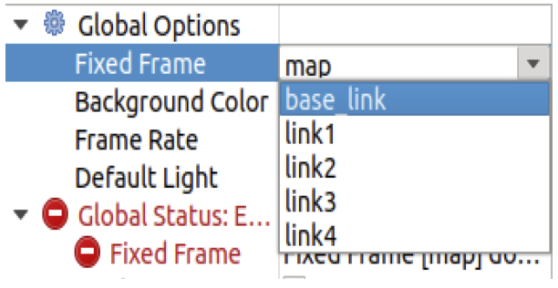
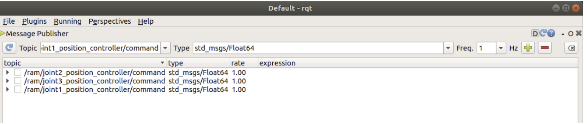

# Robotic Arm Push Lab 


## Description:
   Robot simulation software is making robotic automation safer, less risky, and much more obtainable. In this lab, you will be introduced to the basics of creating a robotic arm using ROS tools such as Rviz and Nodes, and Gazebo; a 3D dynamic simulator that can accurately and efficiently simulate populations of robots in complex indoor and outdoor environments. First, check you have the prerequisites in place, then you can direct to the introduction and get the lab started. 

## Prerequisites: 
* Ubuntu 18.04: https://releases.ubuntu.com/18.04/ (The Desktop Server is Recommended)
* python2 or python3
* Git (`sudo apt-get install git`)
* ROS Melodic: http://wiki.ros.org/melodic/Installation/Ubuntu (Follow the instructions to download)

## Introduction:
In this lab, you are going to design a Robotic Arm Manipulator from scratch, implementing the various elements and attributes to it, and move the robot using ROS topics and rqt. ROS stands for the Robot Operating System. It is an open source robotics middleware which consists of numerous software libraries and tools that will aid you in building robot applications. From drivers to state of the art algorithms and simulations, ROS encompasses all the needs to build a robotics project. It is highly recommended to install ROS and ubuntu through a virtual machine such as: VMware Fusion for MacOS (https://www.vmware.com/products/fusion/fusion-evaluation.html) or freeware VirtualBox available for both but with a bit lower quality (https://www.virtualbox.org/wiki/Downloads), install Ubuntu 18.04 Bionic full-desktop (Ubuntu 18.04.5 LTS (Bionic Beaver). Inside the linux distribution, install ROS melodic from the link provided. After having the prerequisites all set, follow the lab instructions sequentially. First, clone the github repository consisting of a simple RViz model, a gazebo world, launch files, and a simple script in both Python and C++ . If you encounter any issues throughout the trial, you can direct to the debugging issues file provided.

- Go ahead and clone the following github repository:
  ```
  cd ~
  git clone https://github.com/khouka/RoboticArmPush_Lab.git
  ```
- Note: Don’t forget to source your ROS system whenever opening a new shell
  ```
  $ source /opt/ros/melodic/setup.bash
  ```
- Before you run the example, first compile your code in your workspace and source the development folder of the workspace:
  ```
  $ cd  RoboticArmPush_Lab
  $ catkin_make 
  $ source /home/<account name>/RoboticArmPush_Lab/devel/setup.bash
  ```
- After you have successfully compiled the code without errors, it is time to run the launch file. Inside the workspace, run the following command:
  ```
  $ roslaunch minimal_demo coin_rviz.launch
  ```
- The format of launching a ROS launch file is the `roslaunch` command then the `<package name>`, and lastly the `<launch file>`. You should see 2 popup displays:
  <p align="left">
  
  </p>
- Now that we have RViz running let’s display the robot, to do so, you must adjust a few settings in the RViz: 
  - Under the displays panel, there is a fixed Frame, click on the word map, select base_link.
    <p align="left">
    
    </p>  
  - There should be an Add bottom, at the bottom part of the RViz, click on the Add ,  scroll down and select the RobotModel. 
  - After adding the RobotModel the robot should appear, you can move the robot using the joint_state_publisher pop up. As you can see by moving joint 1 we are rotating around the z axis, and on joint 2 we are rotating around the y axis.
    <p align="left">
    
    </p>
- Let’s configure and save the progress, so that you won’t have to readjust the settings every time you run the simulation. 
  - After adjusting the settings. Click on File in the top left corner, then `Save Config As`:
    <p align="left">
    
    </p>
  - Save the configuration inside the launch directory and name it `coin_config.rviz`
  - Lastly, make an adjustment in the `coin_rviz.launch` file by adding: 
    ```
    args=" -d $(find demo)/launch/coin_config.rviz"
    ```
    after the `type="rviz"` part of the code. Save and close the file. 
- Now if you launch the file again, the robot model should appear, as the adjustments were saved. Now let’s go over some basics of ROS, then we will take a look at the code you just ran. 

## ROS Basics:
In this segment, we will briefly go over some of the basics of using ROS. If you want to further learn about ROS, you can also head to the following link: (http://wiki.ros.org/ROS/Tutorials). 
  1. Workspace:
     A catkin workspace is a folder where you modify, build, and install catkin packages. All your work for a specific   project should be encompassed in a workspace. To create a workspace type:
     ```
     $ mkdir <workspace name>
     ```
     It is also good practice to keep all your packages inside an src folder in the workspace:
     ```
     $ cd <workspace name>
     $ mkdir src
     ```
  2. Package:
     A package is a directory that contains all of the files, programs, libraries, and datasets needed to provide some   useful functionality. Every program that you write in ROS will need to be inside a package. To create a package:
     ```
     $ catkin_create_pkg <package name>
     ```

  3. Adding dependencies:
     Inside your catkin package you will see two files: CMakeLists.txt and package.xml.
     - `CMakeLists.txt`:
       CMakeLists.txt file contains a set of directives and instructions describing the project's  source files and          targets. To add depencies, search for the lines:
       ```
       ## is used, also find other catkin packages
       find_package(catkin REQUIRED)
       ```
       Edit to:
       ```
       ## is used, also find other catkin packages
       find_package(catkin REQUIRED COMPONENTS
       package name
       package name
       )
       ```
     - `Package.xml`:
       The same dependencies you added to your CMakelist.txt, you must add here. 
       ```
       <!--   <doc_depend>doxygen</doc_depend> -->
       <buildtool_depend>catkin</buildtool_depend>
       ```
       Add the dependencies in this format, make you sure you save the file afterwards.
       ```
       <build_depend>package name</build_depend>
       <exec_depend>package name</exec_depend>
       ```
  4. Compiling and sourcing:
     After editing the workspace, you must compile your code using:
     ```
     $ catkin_make
     ```
     After compiling you must source the development folder of workspace:
     ```
     $ source /home/<account name>/<workspace name>/devel/setup.bash
     ```
## The Code Explained
- Since this file is in xml format, the file should start with this header. Defining the version first, then the robot name and the xacro xmlns declaration(the link). 
  ```
  <?xml version="1.0"?> 
  <robot name="coin" xmlns:xacro="http://www.ros.org/wiki/xacro">
  ```
- The blue lines are simply for organization and neatness purposes; think of them as dividers, there are many other ways to format your code. `<!--` is used to comment out code in the xml format.
- The material doesn’t display anything by itself, it must be called in one of the links or joints to be used. Think of them as add ons. Here we define materials for color purposes.
  ```
  <material name="< material name >">
    <color rgba="< The Color specified by four numbers representing r/g/b/a >"/>
  </material>
  ```
- Right after that we have the constant definitions. Here is where you will define any constants. The conversion from degree to radians is shown, because that's the unit used.
  ```
  <xacro:property name="deg" value="0.017453293"/>
  ```
- For the next two categories, the links and the joints, we will have a lengthier explanation as they are the fundamentals of any robot simulation. 

### Links:
The link element describes a rigid body with an inertia, visual features, and collision properties. For now we will only focus on the visual property, you will come across the other two properties throughout the lab. Below is an unmodified version of the code.
  ```
  <link name="< name of the link>">            
     <visual>
         <geometry>
            <box size="<size values"/>
         </geometry>
         <material name ="< color name>"/>
         <origin rpy="<link’s rpy>" xyz="<link’s xyz"/>
     </visual>
  </link>
  ```
<p align="left">

</p>
<p align="left">

</p>

### Joints:
The joint element describes the kinematics and the dynamics of the joint. There are a total   of 6 types of joints. For this series we will utilize three; The revolute type, a hinge joint that rotates along the axis.The fixed type, which locks all degrees of freedom. We use this since we need a joint between the two links, otherwise it would bring up a root error. Lastly, for the grippers of the robotic arm, we use the prismatic type, a sliding joint that slides along the axis.
  ```
  <joint name="<joint name>" type="<The type of the joint">
     <parent link="name of the parent link"/>
     <child link="name of the child link"/>
     <axis xyz="The axis differs for each type>" />
     <limit effort="300" lower="rad or m" upper="rad or m" velocity="rad/s or m/s" />
     <origin xyz="" rpy=""/>
  </joint>
  ```
<p align="left">

</p>

### Launch file:
In order to visualize the model in RViz and Gazebo later on, a launch file is mandatory. Launch files are of the format `.launch` and use a specific `XML` format. Inside the repostirty you cloned earlier, direct to the launch directory and open the same  launch file you configured earlier. The point of a launch file in general is that it helps in the task of launching multiple nodes together. This is what we are launching in this launch file:
- The param line locates and loads the xacro file that contains the robot description.
- To start a node, the `<node>` tags are used, which can be seen with the 3 nodes:
  - The first node is for publishing the state of the joints
  - The second node opens RViz with a predefined configuration
  - The third node opens a gui tool so that we can manipulate the joint’s values. 

## Task #1 Preparation and workspace setup
In this task, you will create the workspace structure for this project. Create a workspace called `ramSimulation_ws`,inside create a package called `ram_push`. Add five folders to your package: `config`, `launch`, `urdf`, `scripts`, and `worlds`. Compile and source your workspace. The directory structure should look like the following:
<p align="left">

</p>

## Task #2 Designing the arm manipulator
For this task, build a robotic arm from scratch by using the concepts covered earlier. Create an xml file and name it `ram.xacro` inside the `urdf/` directory. Build the robot there. Inside the `launch/` directory, create a launch file and name it `ram_rviz.launch`. After launching your simulation in RViz save and configure it. Use the diagrams and descriptions below for the characteristics of the links and joints of this robotic arm. 
<p align="left">

</p>

## Task #3 Inertia and Collision Properties 
For this task, implement the Inertia and Collision Properties to the links of the robotic arm you designed in task 1. Both properties are encompassed by the link tag. In order to get your model to simulate properly, you need to define several physical properties of your robot, i.e. the properties that a physics engine like Gazebo would need. 
### Inertia:
Every link element being simulated needs an inertial tag, here is the unmodified format:
 ```
 <inertial>
     <mass value="1"/>
     <inertia ixx="1" ixy="0" ixz="0" iyy="1" iyz="0" izz="1"/>
 </inertial>
 ```
- Interia is a subelement of the link object, must start with `<inertial>` tags
- The mass is defined in kilograms.
- The 3x3 rotational inertia matrix is specified with the inertia element.
 <p align="left">
 
 </p>

### Collison: 
In order to get collision detection to work or to simulate the robot in Gazebo, you must define a collision element as well.
 ```
 <collision>
    <origin xyz="0 0 0" rpy="0 0 0"/>
    <geometry>
       <cylinder radius="0" length="0"/>
    </geometry>
 </collision>
 ```
- The collision element is also a subelement of the link object.
- The collision element defines its shape the same way the visual element does, with a geometry tag. Set it identical to the visual element.
- You can also specify an origin, the origin should be identical to the visual element. 

## Checkpoint:
Your robot should look similar to the one shown below, the joints should be able to move similarly and the collision property should show an identical model when under `RobotModel`you, uncheck the `Visual Enabled` and enable the `Collision Enabled`.
### The robot model:
 <p align="left">
 
 </p>

### Checking the Collision:
 <p align="left">
 
 </p>
 
## Task #4 Simulation using Gazebo
Gazebo is a 3D dynamic simulator which can accurately and efficiently simulate populations of robots in complex indoor and outdoor environments. Gazebo offers physics simulation at a high degree of fidelity, a suite of sensors, and interfaces for both users and programs. You will be using gazebo to design robots, test robotics algorithms, and apply it to real life scenarios. For this task, you will simulate your robot through Gazebo. Read the information below then complete the bulletin letters. 
### Installation:
  ```
  $ source /opt/ros/melodic/setup.bash
  $ sudo apt-get install ros-melodic-gazebo-ros-pkgs ros-melodic-gazebo-ros-control
  ```
### Testing:
  - In a new shell run roscore, Then in another shell run gazebo:
    ```
    $ roscore 
    $ rosrun gazebo_ros gazebo
    ```
The output should be the Gazebo GUI, if you encounter any errors please direct to the debugging page and check Issue 1 and Issue 2. 
### Gazebo plug-in:
 ```
 <!--.........Gazebo plugins........ -->
 <gazebo>
    <plugin name="gazebo_ros_control" filename="libgazebo_ros_control.so">
      <robotNamespace>/ram</robotNamespace>
    </plugin>
 </gazebo>
 ```
- The gazebo_ros_control Gazebo plugin provides a pluginlib-based interface to implement custom interfaces between Gazebo and ros_control for simulating mechanisms or numerous sorts. 
### Gazebo launch file:
To spawn your robot by using gazebo, you must first create a launch file for gazebo. Here is an example:
```
<?xml version="1.0" encoding="UTF-8"?>
<launch>        
 <param name="robot_description" command="$(find xacro)/xacro --inorder '$(find <package name>)/urdf/<file name>.xacro'" />
  <arg name="x" default="0"/>
  <arg name="y" default="0"/>
  <arg name="z" default="0"/>
       
  <node name="<robot name>" pkg="gazebo_ros" type="spawn_model" output="screen"
    args="-urdf -param robot_description -model ram -x $(arg x) -y $(arg y) -z $(arg z)" />             
</launch>
```
- First, define the robot description parameter, using xacro to direct it to the directory in which the ram.xacro file is.
- The next 3 lines are the coordinates where the robot will spawn. 
- The next two lines is the node which will execute the parameters above. 
To launch your gazebo simulation:
-  In a shell, run roscore: 
- In another shell, run the gazebo simulation using: 
  ```
  $ rosrun gazebo_ros gazebo
  ```
- In a third shell, from your workspace directory run the launch file:
  ```
  $ roslaunch ram_push ram_spawn.launch
  ```
- Task 4: Tasks 
  - Add the gazebo plug-in to the ram.xacro file.
  - Create a gazebo launch file inside the launch directory and name it ram_spawn.launch
  - Add a fixed joint inside your xacro file that holds the base_link with the gazebo world.
  - You might receive an error when launching the simulation because of the fixed joint types. Since there is no fixed joint type in SDF similar to one in URDF, a fixed joint does not exist in simulation. The URDF parser eliminates fixed joints by restructuring the URDF contents. There are workarounds for this, constraining the limits to zero can also mean a fixed joint.
  - Set the colors of the links as shown below:
    <p align="left">
    
    </p>

## Task #5 Transmission and Actuators
The transmission element is an extension to the URDF robot description model which can describe the relationship between a joint and an actuator. The controller commands effort on the joint, and the transmission translates them into effort on the actuator. Here is an unmodified transmission element:
```
  <transmission name="trans##">
    <type>transmission_interface/SimpleTransmission</type>
    <joint name="<joint name>">   
      <hardwareInterface>hardware_interface/EffortJointInterface</hardwareInterface>
    </joint>
    <actuator name="motor##"> 
      <hardwareInterface>hardware_interface/EffortJointInterface</hardwareInterface>
      <mechanicalReduction>1</mechanicalReduction>
    </actuator>
  </transmission>
```
- The `transmission tag`, while also defining its name
- `transmission_interface/SimpleTransmission` is the only interface supported. 
- The `hardwareInterface` could be position, velocity, or effort interfaces.
- The hardware interface will be loaded by `gazebo_ros_control` plugin.
- For more information on hardware interfaces, visit the link:(http://wiki.ros.org/ros_control#Hardware_Interfaces)
- Task 5: Tasks 
  - Add the Transmission and Actuators to each joint. It’s more organized to set a new divider and list all the transmissions underneath. 
  - Add the following dependencies to your package:
    ```
    controller_manger 
    joint_state_controller 
    robot_state_publisher
    ```
  - Compile and source your devel directory afterwards

## Task #6 Joint Controllers and PID 
The PID gains and controller settings must be saved in a `yaml` file that gets loaded to the param server via the roslaunch file. After reading the information below, create a yaml file inside the `config/` folder and name it `ram_control.yaml`. Add joint controllers for your robots joints. The typical controller encompasses 2 key segments:
  ```
  The typical controller encompasses 2 key segments:
  # Publish all joint states -----------------------------
  joint_state_controller:
    type: joint_state_controller/JointStateController
    publish_rate: 50
  ```
 - This controller is found in the joint_state_controller package and publishes the state of the robot's joints into ROS directly from Gazebo. 
  ```
  # Position Controllers ----------------------------------
  joint1_position_controller:
   type: effort_controllers/JointPositionController
   joint: joint1
   pid: {p:100.0 , i:0.1, d:10.0}
  ```
 - Use the Position controllers for the robot’s joints. The joint_position_controller (position input goes into a PID controller that outputs force/torque to the joint)
 - From the effort_controllers, we will use the jointPostionController
 - The pid gains; the proportional, integral, and derivative gains.

### Tuning the PID gains:
Use the dynamic reconfigure to tune the proportional, derivative, and integral gains of the PID controller. Having too inaccurate PID values can cause the robot to shake, and act inaccurately when sending commands to the joints. 
- In a new shell launch rqt by running the following:
   ```
   $ rosrun rqt_gui rqt_gui
   ```
- Click on the `Plugins`, then inside the `Configurations`, Add the `Dynamic Reconfigure` plugin to rqt.
  <p align="left">
  
  </p>
- By clicking on ram under gazebo, it should reveal all the 7 joint controllers, by clicking on them the ”pid” option should appear. Clicking on the “pid” option of every joint controller should reveal 5 sliders that let you tune the controller, as shown below.
  - P gains: The error, distance between the actual position and the target position
  - I gains: The accumulative error
  - D gains: The change in error
    <p align="left">
    
    </p>
- To adjust these values send joint command messages through ROS topics or rqt as explained in Task 7. Adjust these values until you get the desired performance of your controller.

## Task #7 Using ROS topics and rqt
Launch your gazebo world and your robot simulation in another shell.  One of the ways to send joint commands is through ROS topics and rqt. There are more ameliorated ways to be used later on. Here a visualization of how the process will undergo:
  <p align="left">
  
  </p>
- In a new shell, run the following to view the topics that are currently running, to learn more about ROS topics, visit the following link(http://wiki.ros.org/Topics):

  ```
  $ rostopic list 
  ```
  <p align="left">
  
  </p> 
  
- Now to send joint commands use the following command line format:

 ```
 $ rostopic pub -1 /ram/joint1_position_controller/command std_msgs/Float64 "data: -1.0"
 ```
- Now let’s do the same, but with rqt. In a new shell launch rqt by running the following:

 ```
 $ rosrun rqt_gui rqt_gui
 ```
 - The rqt popup will display, click on `plugins`, then on `Topics`:
   <p align="left">
   
   </p> 
 - Select the `message publisher`, The Message Publisher sub popup should be displayed, search for the joint’s `joint_position_controller/command` and press the green add button.
   <p align="left">
   
   </p> 
 - Click on the arrow to the left of the `/ram/joint`, and set the expression amount. Finally, for the command  to be sent,  click on the blank box to the right of the arrow.
   <p align="left">
   
   </p> 
   
## Task #8 Gazebo World 
A world in gazebo simply means a collection of robots and objects; such as balls and tables, and global parameters including the sky, and physics properties. It’s good practice to keep your worlds inside a `worlds/` folder. Inside the repository you cloned earlier, go ahead and launch the world example:
 ```
 $ roslaunch minimal_demo demo_world.launch 
 ```
 - Designing your world:
   - Run an empty gazebo simulation
   - Inside you can easily add and adjust models, click on the insert, and select whatever models you want from the vast list.
   - Once you're done, select the File menu and click on Save World As. A pop-up will appear asking you to enter a new filename. Enter brick.world and save it inside the worlds folder.
   - Inside the `launch/` folder, you will find another launch file called `demo_world` which you just simulated. That’s the typical format of a gazebo world launch file. Create a world with a table not so far from the origin. Save it as `table.world` inside the worlds folder. Create a launch file for this world and name it `ram_world.launch`.

## Task #9 ROS Publisher(Python & C++)
Inside the repository you cloned earlier, there is a folder called `scripts/`. The folder contains a simple Python and C++ publisher, just the basic necessary structure of how to send joint commands through ROS publisher in both programming languages. When running these, make sure you have `roscore`, the ros master node, running on a separate shell.

### Writing a Publisher(Python)
A python publisher node consists of a couple mandatory parts. "Node" is the ROS term for an executable that is connected to the ROS network. You can find the full code inside the scripts, `Pub.py` Let’s go over the key segments:
 ```
 #!/usr/bin/env python
 ```
- This should be the first line of your python node, this declaration makes sure your script is executed as a Python script.
 ```
 import rospy
 ```
- You must import rospy if you are writing a ROS Node. Rospy is the python client library for ROS. 
 ```
 from std_msgs.msg import Float64
 ```
- You must also import a message type library for publishing. Here, from the `std_msgs.msg` package  we can import the `Float64` message type, because the joint commands receive their values as Float64. 
 ```
 class <class name>():
    def __init__(self):
        rospy.init_node('<node name>', anonymous=True)
 ```
- First define a class, then the class instructor, `rospy.init_node()`, is very important as it tells rospy the name of your node that until rospy has this information, it cannot start communicating with the ROS Master.
 ```
 self.pub = rospy.Publisher('<ROS topic name', <message type>, queue_size=10) 
 self.pub.publish(<the value>)
 ```
- Using `rospy.Publisher`, you declare that the node publishes messages of the type you declare, which we imported from the `<>.msg` module, over a topic, and lastly set the `queue size` to 10. The queue size limits the amount of queued messages if any subscriber is not receiving them fast enough.
 ```
 def main():
    obj = <class name>()
    obj.<method name>()
 ```
- It’s good practice to finish your code with a main method, the main method should contain all the methods in a chronological order of what the script should execute. 
 ```
 if __name__ == '__main__':
    try:
      main()  
    except rospy.ROSInterruptException:
        pass
 ```
- The program will execute what is written here, simply call the main method you defined earlier, the rospy.ROSInterruptException exception is sed to ignore exceptions which can be thrown by rospy.sleep() and rospy.Rate.sleep() methods when Ctrl-C is pressed.
To run the python file, simply direct to the directory the file is located in and run:
 ```
 $ python <filename>.py
 ```
### Writing a Publisher(C++) 
Similar to how the python publisher node has some key segments, the C++ has some of its own. Writing a C++ node is more complex and requires stricter formatting to work. You can find the full code inside the scripts, `Pub.cpp` Let’s go over the key parts:
```
#include <ros/ros.h>
#include <std_msgs/Float64.h>
```
- ros/ros.h is the ros library that includes all the headers necessary to use the most common pieces of the ROS system. It’s like rospy for the python script. Also import the Float64 message type from std_msgs, as the joint command is in that data type.
 ```
 int main(int argc, char **argv)
 {
  ros::init(argc, argv, "< node name>");
  ros::NodeHandle n;
 ```
- Instantiate the main header, and Initialize ROS. Specify the name of the node. Node names must be unique in a running system. Create a handle to this process' node. The first NodeHandle created will actually do the initialization of the node.
 ```
 ros::Publisher joint1_pub;
 joint1_pub = n.advertise<std_msgs::Float64>("< ROS topic name", 10)
 ```
- First, a publisher is created, then define the publisher using the method provided above, this tells the master that you will publish a message of type std_msgs/Float64 on a topic. The second argument is the size of our publishing queue. 
 ```
 ros::Rate loop_rate(10);
  while (ros::ok())
  {
 ```
- A ros::Rate object allows you to specify a frequency that you would like to loop at. The script will run what is located inside the `ros::ok()`. There are other alternatives, 
 ```
  std_msgs::Float64 <message name>;
  <message name>.data = 2.0;
  joint1_pub.publish(<message name>);
 ```
- Here, we broadcast a message on ROS using a message-adapted class, generally generated from a msg file. Here the standard `Float64` message is used, which has one member: `data`. And the last line is self explanatory, the message is published to the topic. 
 ```
 ros::spinOnce();
   loop_rate.sleep();
  }
}
 ```
- Although `ros::spinOnce()` doesn’t serve much in this program, it’s good practice to keep it in every node. The ros::Rate object sets the program to sleep for the time remaining until the hz publish rate. 
Unlike the python scripts, C++ nodes requires some further steps before executing:
